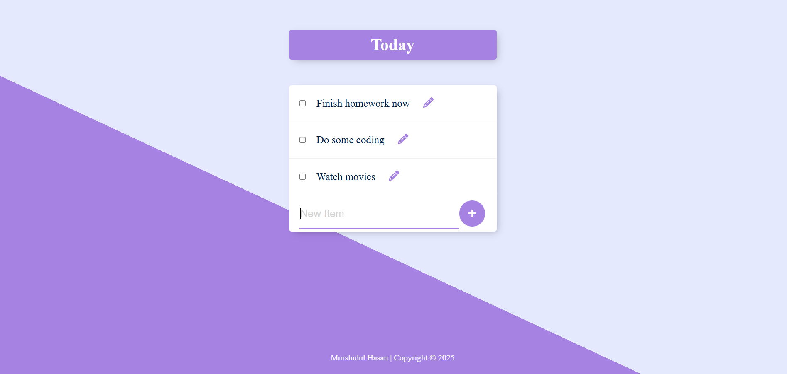

# 📝 Permalist To-Do List App

**Permalist** is a minimalist to-do list web application built with **Node.js**, **Express**, **EJS**, and **PostgreSQL**. It allows users to manage tasks — with the ability to add, edit, and delete items — while storing all data persistently in a PostgreSQL database.

---

## 🚀 Features

- ✅ Add new tasks
- ✏️ Edit existing items inline
- 🗑️ Delete tasks via checkbox
- 📦 Persistent storage using PostgreSQL
- 🔐 Secure credentials with `.env` and `dotenv`
- 🎨 Clean and dynamic frontend using EJS

---

## ⚙️ Tech Stack

| Layer        | Technology            |
|--------------|------------------------|
| Server       | Node.js, Express       |
| View Engine  | EJS                    |
| Database     | PostgreSQL             |
| Dev Tools    | dotenv, body-parser    |

---

## 📂 Project Structure

```
permalist-todo/
│
├── views/                 # EJS templates
│   └── index.ejs
│
├── public/                # Static files (CSS, icons)
│
├── .env                   # Environment variables (excluded from Git)
├── .gitignore             # Ignored files/folders
├── index.js               # Express server logic
├── package.json           # NPM dependencies
└── README.md              # Project documentation
```

---

## 🛠️ Getting Started

### 1. Clone the repository

```bash
git clone https://github.com/simon681/permalist-todo.git
cd permalist-todo
```

### 2. Install dependencies

```bash
npm install
```

### 3. Create `.env` file

```bash
touch .env
```

Add the following with your PostgreSQL credentials:

```
DB_USER=your_db_user
DB_HOST=localhost
DB_NAME=permalist
DB_PASSWORD=your_db_password
DB_PORT=5432
```

### 4. Create the `items` table in PostgreSQL

```sql
CREATE TABLE items (
  id SERIAL PRIMARY KEY,
  title TEXT NOT NULL
);
```

### 5. Start the app

```bash
node index.js
```

Then visit: [http://localhost:3000](http://localhost:3000)

---

## 🧪 Sample Screenshot



---

## 📌 License

This project is licensed under the [MIT License](LICENSE).

---

## 🙌 Acknowledgments

Built as part of a personal web development project by [Murshidul Hasan](https://github.com/simon681).