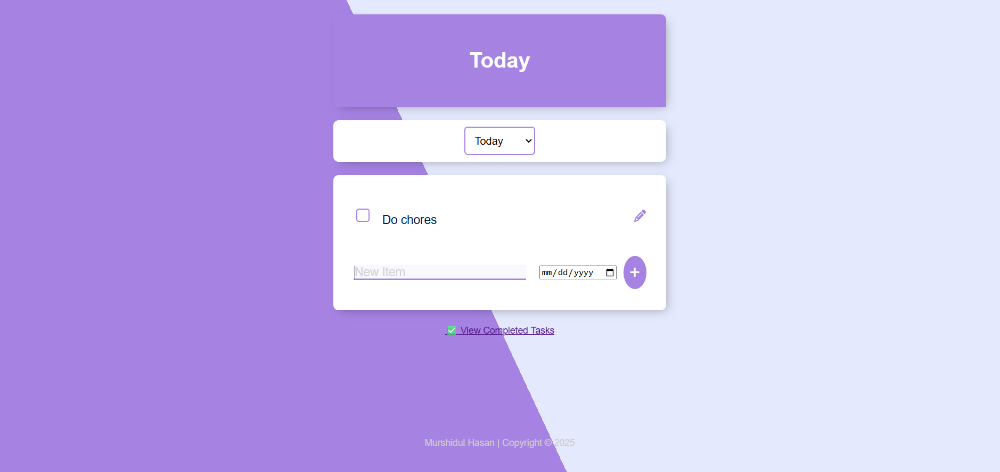
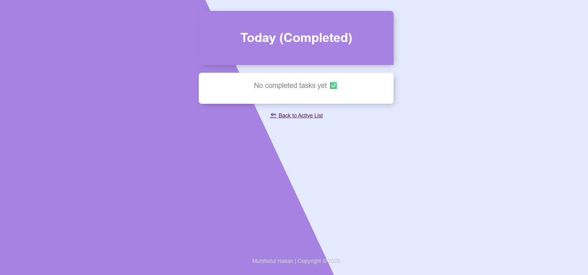

# 📝 Multi-List To-Do App with PostgreSQL + Node.js + EJS

A full-featured, multi-list to-do web application built with Express.js, PostgreSQL, and EJS templating. Designed for productivity and built with extendability in mind.

## 🚀 Features

- 🗂 Multiple named lists (e.g., Work, Family, Personal)
- ➕ Add tasks with optional due dates
- ✅ Mark tasks as completed
- 🔁 Undo completed tasks
- 🗑 Permanently delete tasks
- 🔍 View upcoming or overdue tasks
- 📅 Pagination support
- 📦 PostgreSQL backend with schema-based organization
- 🎨 Clean, responsive UI with light/dark theme support *(optional)*

## 📸 Screenshots




## 🛠 Stack

- **Backend**: Node.js, Express.js
- **Frontend**: HTML, CSS, EJS Templates
- **Database**: PostgreSQL
- **Tools**: dotenv, body-parser

## 📂 Folder Structure

```
/public          → Static assets (CSS, icons)
/views           → EJS templates
/partials        → Shared layout files (header/footer)
index.js         → Main Express server
.env             → Environment variables
README.md        → Project documentation
```

## ⚙️ Setup Instructions

1. **Clone the repo**:
   ```bash
   git clone https://github.com/simon681/todo-app.git
   cd todo-app
   ```

2. **Install dependencies**:
   ```bash
   npm install
   ```

3. **Set up PostgreSQL**:
   - Create the database and `items` table using `queries.sql` (optional)
   - Add your DB credentials to `.env`

4. **Run the server**:
   ```bash
   nodemon index.js
   ```

5. **Visit**:
   ```
   http://localhost:3000
   ```

## 🧠 To-Do (Future Enhancements)

- [ ] User accounts & login
- [ ] Drag & drop sorting
- [ ] Recurring tasks
- [ ] REST API support
- [ ] PWA & mobile responsiveness

## 📄 License

MIT

---

### ✨ Credits
Developed by [Murshidul Hasan](https://murshidul.com)